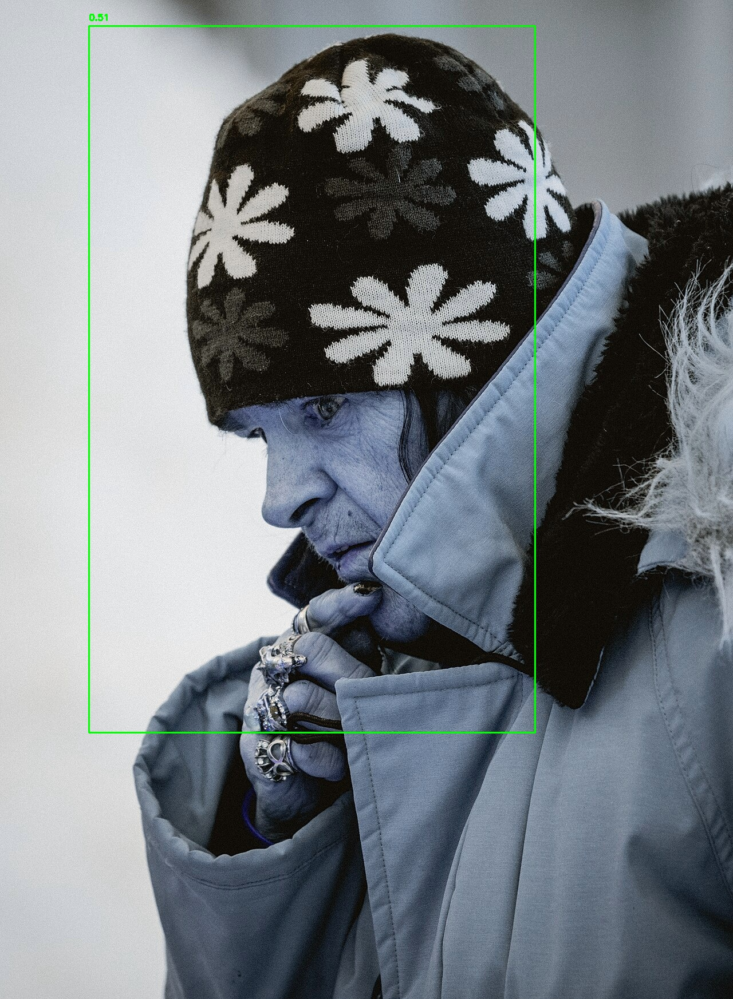
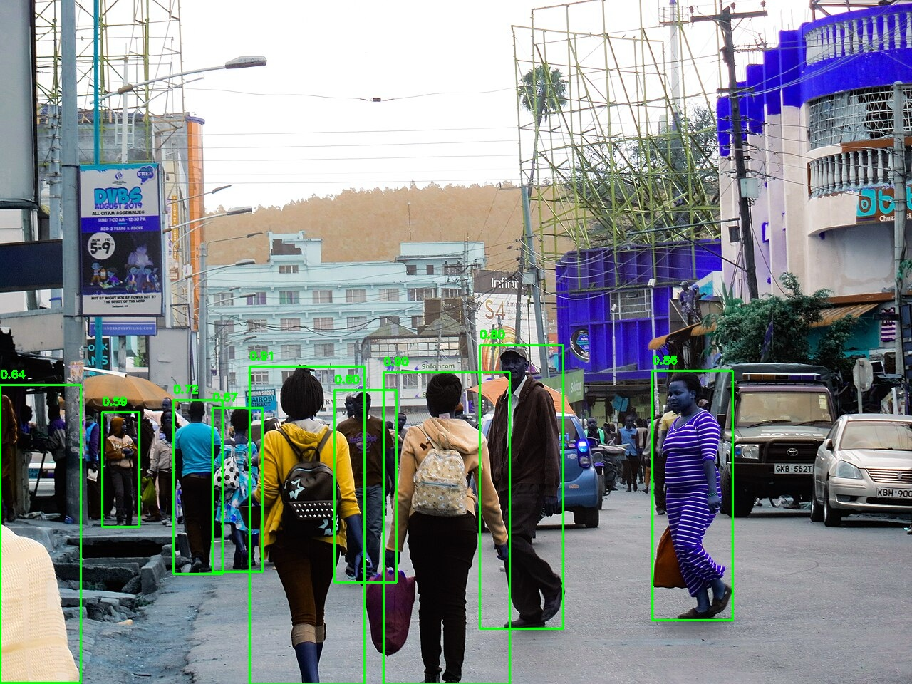
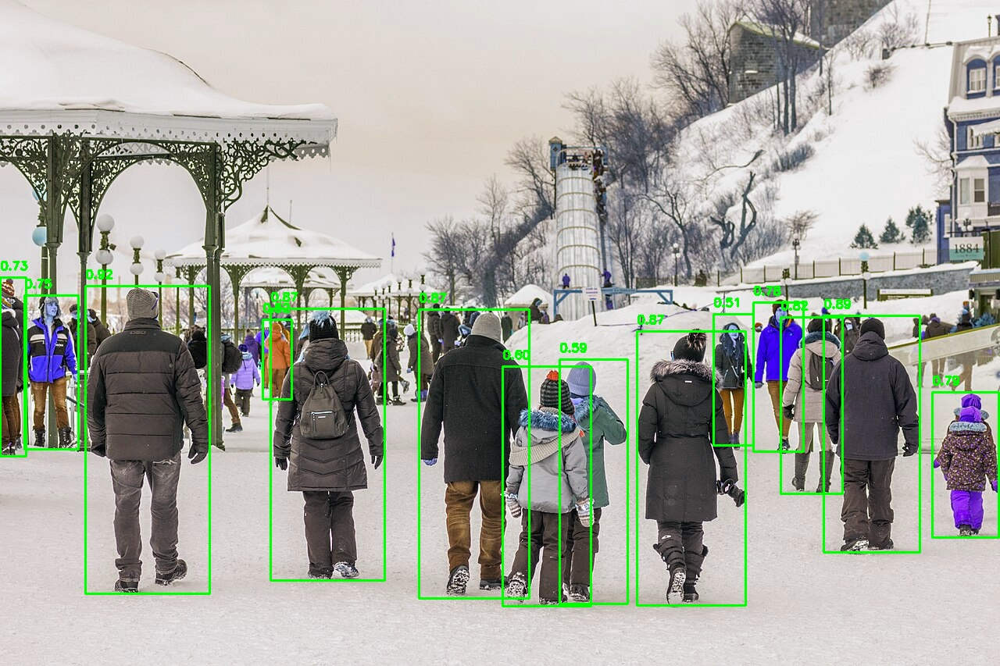

# Detecto

Real-time person detection and counting system. A FastAPI backend runs YOLOv8 person
detection on uploaded images, returns bounding boxes with confidence scores plus an
annotated image, and stores every detection with a timestamp for later analysis. A
React + Vite frontend (see #4) provides the dashboard.

## Architecture

```
┌─────────────┐  POST /api/detect   ┌──────────────────────────────┐
│  React/Vite │ ───────────────────→│  FastAPI backend             │
│  dashboard  │ ←───────────────────│  - validation                │
└─────────────┘  JSON + base64 img  │  - YOLOv8 person detection   │
                                    │  - perf logging + history    │
                                    └──────────────┬───────────────┘
                                                   │
                                          detections.json
                                          logs/performance.log
```

- `backend/` — FastAPI app: `/api/detect`, `/api/history`, `/api/reset`; YOLOv8
  (`utils/detector.py`), JSON-file history (`utils/storage.py`), perf logging
  (`utils/perf_log.py`).
- `frontend/` — React + Vite single-page app (Detection + History pages).

See [EXPLAINED.md](EXPLAINED.md) for a full walkthrough of the code, the changes, why
they were made, and an explanation of every test.

## Setup

Backend requirements are in `requirements.txt` (root, identical to
`backend/requirements.txt`).

```bash
python -m venv .venv
source .venv/bin/activate
pip install -r requirements.txt

# config (optional; sensible defaults exist)
cp backend/.env.example backend/.env

# run the server (from the repo root)
uvicorn backend.main:app --reload --host 0.0.0.0 --port 8000
```

Quick check: `curl http://localhost:8000/health` → `{"status":"healthy"}`.
Interactive API docs: http://localhost:8000/docs.

Frontend (dev):

```bash
cd frontend
npm install
npm run dev
```

## API endpoints

| Endpoint | Description |
|----------|-------------|
| `GET /` | Welcome message |
| `GET /health` | Health check |
| `POST /api/detect` | Upload an image (`file` field, JPEG/PNG, ≤ 15 MB). Returns `count`, `detections` (bbox + confidence), `average_confidence`, `inference_time`, `annotated_image` (base64) |
| `GET /api/history?date=YYYY-MM-DD&limit=100` | Past detections, optional date filter, most recent `limit` |
| `DELETE /api/history` | Clear detection history |
| `POST /api/reset` | Alias of the DELETE above |

Example detect call:

```bash
curl -X POST http://localhost:8000/api/detect -F "file=@sample.jpg"
```

Error handling: unreadable/missing files, empty uploads, oversized images (413),
unsupported types (415), and corrupt payloads (400) are all rejected explicitly.

## Testing

Backend tests run against fake detector/storage, so **no ML stack is required** to run
them (only fastapi, pillow, numpy, python-multipart, pytest, httpx).

```bash
python -m pytest backend/tests -v    # 12 tests
```

Covered: valid detection flow and response shape, unsupported type, empty upload,
corrupt image, missing file, oversized image, empty history, history after a detection,
date filter, limit, `DELETE /api/history`, and `POST /api/reset`.

## Evaluation & metrics

The project requires measuring model performance on ≥ 10 sample images. Place samples in
`frontend/public/samples/` (e.g. `frame1.jpg` … `frame10.jpg`), run detection on each,
then record:

| Metric | Formula / description | Target |
|--------|----------------------|--------|
| Detection Accuracy | Correct detections ÷ total visible persons | ≥ 85 % |
| False Positives | Non-person detections | ≤ 10 % |
| Average Inference Time | Mean processing time per image | ≤ 1.5 s |
| Average Confidence | Mean confidence of valid detections | ≥ 0.7 |
| System Reliability | All test images processed without errors | 100 % |

_raw numbers accumulate automatically in `backend/logs/performance.log`._

### Real benchmark (conf threshold 0.5, CPU, `yolov8n.pt`)

13 sample images run through `POST /api/detect` (originals in `backend/samples/`,
annotated copies in `backend/samples/annotated/`):

| # | Image | Detected | Avg conf | Infer (s) |
|---|-------|---------:|---------:|----------:|
| 1 | Busy street, Yabelo (Ethiopia) | 9 | 0.777 | *2.754 (warm-up)* |
| 2 | Busy street, Dhaka | 1 | 0.573 | 0.456 |
| 3 | Christmas market crowd, Winchester | 10 | 0.598 | 0.469 |
| 4 | Snowy street, Brooklyn | 2 | 0.857 | 0.388 |
| 5 | Night market, Kenting (low light) | 5 | 0.717 | 0.285 |
| 6 | London Stadium crowd control | 0 | — | 0.250 |
| 7 | Pedestrian crosswalk | 9 | 0.744 | 0.419 |
| 8 | High Line, NYC | 4 | 0.759 | 0.326 |
| 9 | Dufferin Terrace winter crowd | 14 | 0.751 | 0.443 |
| 10 | Single pedestrian, Quebec City | 1 | 0.510 | 0.435 |
| 11 | Queue outside a mall | 5 | 0.725 | 0.263 |
| 12 | Shibuya scramble crossing, Tokyo | 7 | 0.708 | 0.456 |
| 13 | Pedestrians, Jerusalem | 7 | 0.780 | 0.267 |

**Measured:** 74 persons across 13 images · mean confidence **0.708** (≥ 0.7 ✅) ·
mean inference **0.56 s** (≤ 1.5 s ✅; ~0.38 s excluding the first-call warm-up) ·
**13/13 images processed without errors (100 % ✅)**.

**Known limitation (logged failure):** the London Stadium crowd detected **0** persons
at conf ≥ 0.5 — a distant, heavily occluded crowd. This is the classic
"occlusion/partial visibility" failure the project asks to document; single, clear
subjects (image 10) score perfectly (1/1).

**Manual step:** Detection Accuracy and False-Positive % are computed against your own
manual count of visible persons per image — open any `backend/samples/annotated/*.jpg`,
count the people, and fill the `visible_persons` column to finalise the percentages.

### Screenshots





## Current status

- ✅ Backend implemented and tested (12/12): detect + history + reset, upload
  validation, perf logging, deterministic storage path, lifespan-managed model.
- ✅ 13 real-world sample images (crowds, crosswalks, night market, snow) in
  `backend/samples/` and `frontend/public/samples/`; benchmark run and README table
  populated. (Sample photos are from Wikimedia Commons under their respective CC
  licenses.)
- ⏳ Frontend: scaffolding only — pages return `null`; the React/Vite dashboard is
  the remaining work.